# Yardsale™ by Valentin Haenel #

Ich verlasse Berlin Ende November. Hier verkaufe ich mein Hab und Gut.  Du bist an
einem oder mehreren der Gegenstände interessiert? Schicke eine E-Mail an
[yardsale@haenel.co](mailto:yardsale@haenel.co)(bevorzugt) oder ruf an:
0176/66604935(wenn es sein muss).

Die Sachen sind alle für Selbstabholer und befinden sich in der
Oderstr. 10247 F'hain.

* Noch zu verkaufen/verschenken: WWWWWW
* Bereits verkauft: ZZZZZZ  ([Verkaufte Gegenstände](sold.html))
* Zuletzt aktualisiert: YYYYYY

***

* Version: XXXXXX
* [Quellen auf Github](https://github.com/esc/myyardsale)
* [RSS atom feed der commits](https://github.com/esc/myyardsale/commits/master.atom)
* Kurze URL: [http://krzz.de/1t](http://krzz.de/1t)
* [Google Translate](http://translate.google.com/translate?hl=en&sl=de&tl=en&u=http%3A%2F%2Fhaenel.co%2Fyardsale%2F)
* Proudly made with ``vim``,``git``, ``markdown``, ``make`` and ``imagemagick``

***

#### Bügelbrett ####

* Bezug intakt
* Stabiles Gestell
* Hinreißend schöne Blumenmuster
* VB: 10,- €

***

#### Helle Klappstühle ####

* NEU: jetzt auch in hell!
* 2 Stück
* So stabil wie Klappstühle halt sein können
* Je: 3,- €
* Zusammen: 5,- €

***

#### Stabilere Stühle ####

* Stabile (nicht klappbare) Stühle
* Höhe: ca. 45 cm
* Je: 4,- €
* Zusammen: 6,- €

***

#### Pinguin Klobrille ####

* Formschöne Klobrille mit Pinguinen
* VB: 15,- €

***

#### Mülleimer ####

* Mülleimer aus Plastik
* 2 Stück, einer rot, der andere Gelb
* Ideal zur Mülltrennung
* Je: 3,- €
* Zusammen: 5,- €

***

#### Kaffeemaschine ####

* Hersteller: Petra
* Fassungsvermögen ca. 10 Tassen
* Mit eingebautem Filter
* VB: 10,- €

***

#### Toaster ####

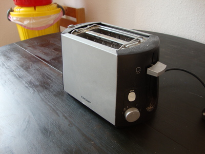

* Hersteller: Cloer
* Mit Stopknopf und Krümmellade
* Fassungsvermögen: zwei Toasts auf einmal
* VB: 7,- €

***

#### Wasserkocher ####

* Hersteller: Grosseg
* Fassungsvermögen: 1L
* VB: 3,- €

***

#### Kleine Deckenleuchte ####

* Kleine Deckenleuchte von IKEA
* Mit drei Birnen inklusive
* 2 Stück verfügbar
* VB: 5,- € Stück

***

#### Große Deckenleuchte ####

* Große Deckenleuchte von IKEA
* Mit vier Birnen inklusive
* VB: 7,- €

***

#### Duschvorhang ####

* Duschvorhang (sauber und gepflegt) inklusive Halterung
* Entspannende Pinguinmotive
* Maße: 90x90
* Duschvorhang deckt leider nur ein Drittel ab
* VB: 15,- €

***

#### Wäschetrockner ####

* Hersteller: Leifheit
* Zum anschrauben
* VB: 5,- €

***

#### Allzweckregal ####

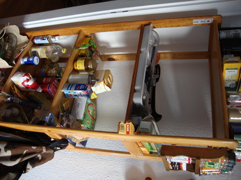

* Aus Holz
* Mit 5 Einlagen
* Höhe: 160 cm, Breite: 68 cm, Tiefe: 33 cm
* VB: 25,- €

***

#### Kühlschrank ####

* Hersteller: Beko
* ...hat leider einen Transportschaden, zwei Dellen in der Tür :-(
* VB: 40,- €

***

#### Waschmaschine ####

* Hersteller: Bloomberg
* Ca. zwei Jahre alt
* Guter Zustand
* VB: 100,- €

***

#### Bücherregal ####

* Bücherregal von IKEA
* Mit vier Fächern
* Höhe: 80 cm, Breite: 80 cm, Tiefe: 39 cm
* VB: 30,- €

***

#### Schwarzes Schränkchen ####

* Mit drei Schubladen und Rollen
* Höhe: 70 cm, Breite 37 cm ,Tiefe: 50 cm
* VB: 25,- €

***

#### Kommode ####

* IKEA Kommode
* Mit drei Schubladen
* Höhe: 100 cm, Breite: 80 cm, Tiefe: 45 cm
* VB: 35,- €

***

#### Schrank ####

* IKEA Hänge-Schrank für Mäntel und Jacken
* Mit Zwei Türen
* Höhe: 180 cm, Breite: 80 cm, Tiefe: 50 cm
* VB: 35,- €

***

#### Helles Schränkchen ####

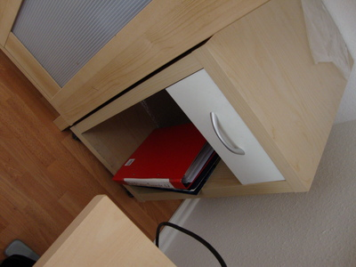

* Mit einer Schublade und Rollen
* Höhe: 72 cm, Breite 37 cm ,Tiefe: 50 cm
* VB: 20,- €

***

#### Ventilator ####

* Durchmesser: 27 cm
* Zwei Geschwindigkeiten
* Mit Feststellknopf
* VB: 25,- €

***

#### Tisch  ####

* Schwarzer, runder Tisch
* Durchmesser: 120 cm
* Höhe: 75 cm
* Inklusive Verlängerung: 38 cm
* VB: 30,- €

***

#### Schuregal ####

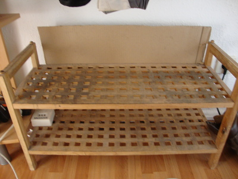

* Schuregal mit zwei Ablagen
* Stark verschmutzt
* VB: 5,- €

***

#### Regal ####

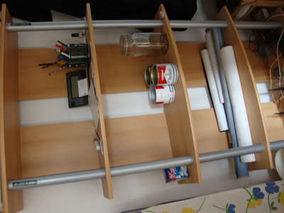

* Offenes Regal
* Höhe: 167 cm, Breite: 88 cm, Tiefe 33 cm
* VB: 25,- €

***

#### Audiokarte ####

* [PCI Audiokarte von M-Audio](http://www.m-audio.com/products/en_us/Audiophile2496.html)
* VB: 35,- €

***

#### Netzwerkkarte ####

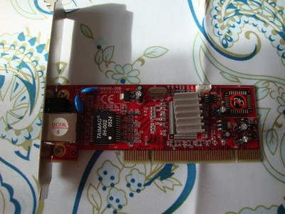

* PCI Gigabit Netzwerkkarte
* VB: 5,- €

***

#### SATA-Karte ####

* 4-Port PCI SATA Karte von Promise
* VB: 25,- €

***

#### Router ####

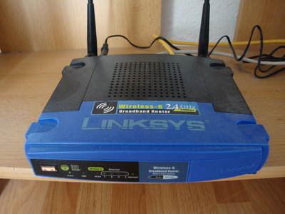

* WLAN Router von Linksys WRT54GL v1.1
* VB 25,- €

***

#### Diverse Karten ####

* Diverse Karten: Grafik, Netzwerk, WLAN, Firewire
* Für Bastler
* VB: 10,- €

***

#### Netzwerkkabel ####

* Diverse Netzwerkkabel
* Für Bastler
* VB: 10,- €

***

#### Arbeitsspeicher  ####

* Diverse Riegel Arbeitsspeicher
* Für Bastler
* VB: 3,- €

***

#### Netzwerkkarte für Notebooks ####

* PCMCIA Netzwerkkarte
* Sehr alt und hat Wackelkontakt
* VB: 1,- €

***

#### PCMCIA USB Hub  ####

* PCMCIA USB Hub mit 4 Ports
* VB: 4,- €

***

#### Audiokabel ####

* Diverse Audiokabel
* Für Bastler
* VB: 10,- €

***

#### PC Lüfter  ####

* Drei Lüfter von Papst
* Hohe Umdrehungszahl
* VB: 9,- €

***

#### Reste einer Kabelsammlung ####

* Reste meiner Kabelsammlung
* Für Bastler
* Zu verschenken

***

#### USB Kabel ####

* Diverse USB Kabel
* Für Bastler
* VB: 5,- €

***

#### SATA Kabel ####

* Diverse SATA Kabel
* Für Bastler
* VB: 10,- €

***

#### Laptop Tasche ####

* Laptop Tasche von Asus mit vielen Fächern
* Für 15 Zoll Notebooks
* Nie benutzt, wie neu!
* VB: 15,- €

***

#### Adidas Sneaker ####

* Adidas Sneaker Superstar
* Größe: 44 2/3
* Ungetragen, sind mir zu groß
* VB: 25,- €

***

#### Naruto Sammelkartenspiel ####

* Fast komplette Serie Eins, inkl vielen Dubletten
* Sehr guter Zustand
* Für Sammler
* VB: 30,- €

***

#### Netzteile ####

* Diverse Netzteile, auch Ausländisch
* Für Bastler
* Zu Verschenken

***

#### Universal Netzteile ####

* Zwei universal Netzteile
* Leider nur ein Satz Stecker
* VB: 20,- €

***

#### Audio/Video Kabel ####

* Zwei Audio/Video Kabel für Fernseher(?)
* VB: 6,- €

***

#### LED Mousepad ####

* Blau leuchtendes LED Mousepad mit 4-Port USB Hub
* VB: 5,- €

***

#### Kaltgerätekabel ####

* Diverse Kaltgerätekabel
* VB: 10,- €

***

#### Telefon ####

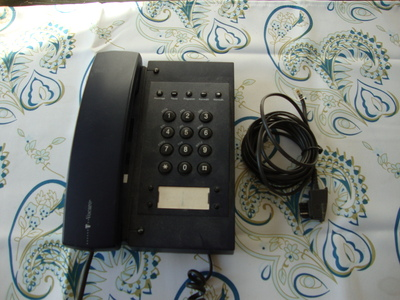

* Telekom Volcano
* Schnurgebundenes Telefon
* VB: 5,- €

***

#### USB Licht ####

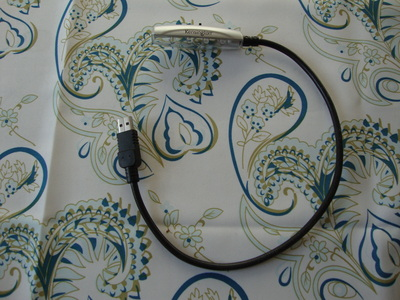

* USB Licht von Kensington
* VB: 3,- €

***

#### Logitech Funkmaus ####

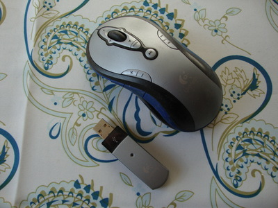

* Mit vielen extra Tasten
* VB: 12,- €

***

#### Funkmaus von Genius ####

* Etwas kleiners Format
* VB: 8,- €

***

#### USB Netlink ####

* Netlink Kabel
* VB: 3,- €

***

#### Holzschränkchen ####

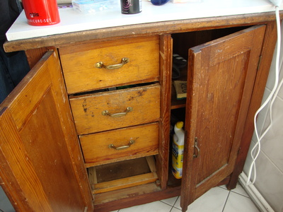

* Links drei Schubladen, rechts zwei Ablagen
* Links hinten wurde ein Teil herausgesägt
* Höhe: 85 cm, Breite: 77 cm, Tiefe: 44 cm
* VB: 15,- €

***

#### Wäschekorb ####

* Blauer Wäschekorb
* Höhe: 60 cm, Breite: 45cm, Tiefe: 35 cm
* VB: 5,- €

***

#### CD/DVD Drive Enclosure ####

* Enclosure für CD/DVD Laufwerke
* Zu verschenken

***

#### Wäschewanne ####

* Wäschewanne
* VB: 5,- €

***

#### Kleiner Tisch ####

* Höhe: 45 cm, Breite 55 cm,
* VB: 5,- €

***

#### Fernseher ####

* Alter Röhrenfernseher von Philips
* Bilddiagonale: ca 52 cm
* VB: 10,- €

***

#### Boxen ####

* Activboxen von McCrypt
* 4 Ohm 110 dB
* 50 - 20,000 Hz
* 80 W R.M.S. 100 W Max
* Inklusive langen XLR Kabeln
* VB: 100,- € (zusammen)

***
