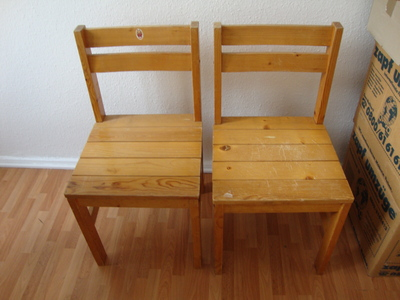
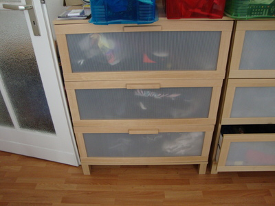
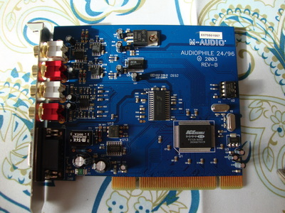
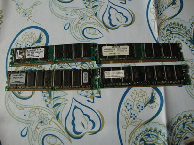
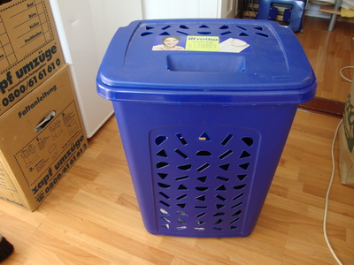
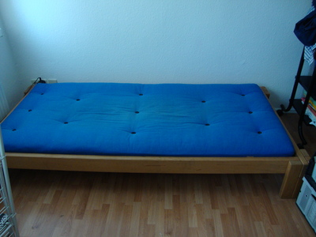
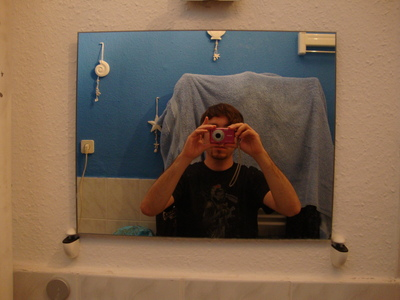

# Yardsale™ by Valentin Haenel #

Ich verlasse Berlin Ende November. Hier verkaufe ich mein Hab und Gut.  Du bist an
einem oder mehreren der Gegenstände interessiert? Schicke eine E-Mail an
[yardsale@haenel.co](mailto:yardsale@haenel.co)(bevorzugt) oder ruf an:
0176/66604935(wenn es sein muss).

Die Sachen sind alle für Selbstabholer und befinden sich in der
[Oderstr. 22 10247 F'hain](http://krzz.de/1D)

* Noch zu verkaufen/verschenken: WWWWWW
* Bereits verkauft: ZZZZZZ  ([Verkaufte Gegenstände](sold.html))
* Zuletzt aktualisiert: YYYYYY

***

* Version: XXXXXX
* [Quellen auf Github](https://github.com/esc/myyardsale)
* [RSS Atom Feed der Commits](https://github.com/esc/myyardsale/commits/master.atom)
* Kurze URL: [http://krzz.de/1t](http://krzz.de/1t)
* [Google Translate](http://translate.google.com/translate?hl=en&sl=de&tl=en&u=http%3A%2F%2Fhaenel.co%2Fyardsale%2F)
* Blog Posts: [Julius Plenz](http://blog.plenz.com/2011-10/yardsale.html)
* Proudly made with ``vim``,``git``, ``markdown``, ``make`` and ``imagemagick``

***

#### Stabilere Stühle ####

* Stabile (nicht klappbare) Stühle
* Höhe: ca. 45 cm
* Je: 4,- €
* Zusammen: 6,- €

***

#### Pinguin Klobrille ####

* Formschöne Klobrille mit Pinguinen
* VB: 15,- €

***

#### Mülleimer ####

* Mülleimer aus Plastik
* 2 Stück, einer rot, der andere Gelb
* **SOLD der gelbe ist weg Wed Oct 26 08:51:48 CEST 2011**
* Idea zur Mülltrennung
* Je: 3,- €
* Zusammen: 5,- €

***

#### Kaffeemaschine ####

* Hersteller: Petra
* Fassungsvermögen ca. 10 Tassen
* Mit eingebautem Filter
* VB: 10,- €

***

#### Wasserkocher ####

* Hersteller: Grosseg
* Fassungsvermögen: 1L
* VB: 3,- €

***

#### Kleine Deckenleuchte ####

* Kleine Deckenleuchte von IKEA
* Mit drei Birnen inklusive
* 2 Stück verfügbar
* VB: 5,- € Stück

***

#### Große Deckenleuchte ####

* Große Deckenleuchte von IKEA
* Mit vier Birnen inklusive
* VB: 7,- €

***

#### Duschvorhang ####

* Duschvorhang (sauber und gepflegt) inklusive Halterung
* Entspannende Pinguinmotive
* Maße: 90x90
* Duschvorhang deckt leider nur ein Drittel ab
* VB: 15,- €

***

#### Kommode ####

* IKEA Kommode
* Mit drei Schubladen
* Höhe: 100 cm, Breite: 80 cm, Tiefe: 45 cm
* VB: 35,- €

***

#### Schrank ####

* IKEA Hänge-Schrank für Mäntel und Jacken
* Mit Zwei Türen
* Höhe: 180 cm, Breite: 80 cm, Tiefe: 50 cm
* VB: 35,- €

***

#### Helles Schränkchen ####

* Mit einer Schublade und Rollen
* Höhe: 72 cm, Breite 37 cm ,Tiefe: 50 cm
* VB: 20,- €

***

#### Ventilator ####

* Durchmesser: 27 cm
* Zwei Geschwindigkeiten
* Mit Feststellknopf
* VB: 25,- €

***

#### Tisch  ####

* Schwarzer, runder Tisch
* Durchmesser: 120 cm
* Höhe: 75 cm
* Inklusive Verlängerung: 38 cm
* VB: 30,- €

***

#### Regal ####

* Offenes Regal
* Höhe: 167 cm, Breite: 88 cm, Tiefe 33 cm
* VB: 25,- €

***

#### Audiokarte ####

* [PCI Audiokarte von M-Audio](http://www.m-audio.com/products/en_us/Audiophile2496.html)
* VB: 35,- €

***

#### Netzwerkkarte ####

* PCI Gigabit Netzwerkkarte
* VB: 5,- €

***

#### SATA-Karte ####

* 4-Port PCI SATA Karte von Promise
* VB: 25,- €

***

#### Diverse Karten ####

* Diverse Karten: Grafik, Netzwerk, WLAN, Firewire
* Für Bastler
* VB: 10,- €

***

#### Netzwerkkabel ####

* Diverse Netzwerkkabel
* Für Bastler
* VB: 10,- €

***

#### Arbeitsspeicher  ####

* Diverse Riegel Arbeitsspeicher
* Für Bastler
* VB: 3,- €

***

#### Netzwerkkarte für Notebooks ####

* PCMCIA Netzwerkkarte
* Sehr alt und hat Wackelkontakt
* VB: 1,- €

***

#### PCMCIA USB Hub  ####

* PCMCIA USB Hub mit 4 Ports
* VB: 4,- €

***

#### Reste einer Kabelsammlung ####

* Reste meiner Kabelsammlung
* Für Bastler
* Zu verschenken

***

#### USB Kabel ####

* Diverse USB Kabel
* Für Bastler
* VB: 5,- €

***

#### SATA Kabel ####

* Diverse SATA Kabel
* Für Bastler
* VB: 10,- €

***

#### Laptop Tasche ####

* Laptop Tasche von Asus mit vielen Fächern
* Für 15 Zoll Notebooks
* Nie benutzt, wie neu!
* VB: 15,- €

***

#### Adidas Sneaker ####

* Adidas Sneaker Superstar
* Größe: 44 2/3
* Ungetragen, sind mir zu groß
* VB: 25,- €

***

#### Naruto Sammelkartenspiel ####

* Fast komplette Serie Eins, inkl vielen Dubletten
* Sehr guter Zustand
* Für Sammler
* VB: 30,- €

***

#### Netzteile ####

* Diverse Netzteile, auch Ausländisch
* Für Bastler
* Zu Verschenken

***

#### Universal Netzteile ####

* Zwei universal Netzteile
* Leider nur ein Satz Stecker
* VB: 20,- €

***

#### Audio/Video Kabel ####

* Zwei Audio/Video Kabel für Fernseher(?)
* VB: 6,- €

***

#### LED Mousepad ####

* Blau leuchtendes LED Mousepad mit 4-Port USB Hub
* VB: 5,- €

***

#### Kaltgerätekabel ####

* Diverse Kaltgerätekabel
* VB: 10,- €

***

#### Telefon ####

* Telekom Volcano
* Schnurgebundenes Telefon
* VB: 5,- €

***

#### USB Netlink ####

* Netlink Kabel
* VB: 3,- €

***

#### Wäschekorb ####

* Blauer Wäschekorb
* Höhe: 60 cm, Breite: 45cm, Tiefe: 35 cm
* VB: 5,- €

***

#### CD/DVD Drive Enclosure ####

* Enclosure für CD/DVD Laufwerke
* Zu verschenken

***

#### Wäschewanne ####

* Wäschewanne
* VB: 5,- €

***

#### Kleiner Tisch ####

* Höhe: 45 cm, Breite 55 cm,
* VB: 5,- €

***

#### Fernseh Tisch ####

* Tisch mit Rollen, ideal für Fernseher oder so
* VB: 5,- €

***

#### Schreibtisch  ####

* Schwarzer Schreibtisch von IKEA
* Zwei verfügbar
* Leider mit Kratzern und Abnutzungsspuren
* Höhe: 75 cm, Breite: 140 cm, Tiefe: 75 cm
* VB: 30,- € (Stück)

***

#### Bett (Futon) ####

* Die Matratze ist etwas härter, ist ja auch ein Futon
* Hervoragendes Schlafgefühl
* Höhe: 30 cm, Länge: 215 cm, Breite: 115 cm
* VB: 75,- €

***

#### DJ Setup ####

* Mixer und zwei CD-Player in einem Flightcase
* [DJM 800](http://www.pioneer.eu/uk/products/44/74/461/DJM-800/index.html)
* [CDJ 1000 MK3](http://www.pioneer.eu/eur/products/archive/CDJ-1000 MK3/index.html)
* [Case von ZOMO](http://www.zomo.de/en/Products/Cases/Equipment-Cases/Set-Cases/Zomo-Set-800-Flightcase-for-2x-CDJ-800-1x-DJM-600-800-700.html)
* Ca. 4 Jahre alt, aber in sehr gutem Zustand, nie auf Partys gewesen, nur bei mir zu Hause rumgestanden. Drum verkaufe ich sie ja.
* Inklusive diversen Kabeln
* VB: 1600,- €

***

#### Chefsessel ####

* Chefsessel
* Feststellmechanik defekt, daher:
* Zu verschenken

***

#### Lampe ####

* Zum an die Wand montieren
* VB: 3,- €

***

#### Lampen  ####

* Satz Lampen
* Eine einzelne und eine doppelte
* VB: 5,- €

***

#### Wasserkessel ####

* Von WMF
* Für Gas, Ceran, Induktion...
* Wirklich schönes Stück
* VB: 15,- €

***

#### Fußmatte ####

* Abtreter/Fußmatte
* Anthrazit
* VB: 3,- €

***

#### Ablage ####

* In brauner Optik
* VB: 3,- €

***

#### PC Schrauben etc. ####

* Diverse PC Schrauben, Hitzepaste, BIOS Batterien, Motherboard-Mounter, Jumper etc..
* Gut sortiert
* Optimal für Bastler
* VB: 15,- €

***

#### Zwei Glasablagen ####

* Inklusive Halterung
* VB: 15,- €

***

#### Spiegel ####

* Badezimmerspiegel
* VB: 3,- €

***

#### PC Leichen ####

* Drei PC Leichen
* Zu verschenken

***
